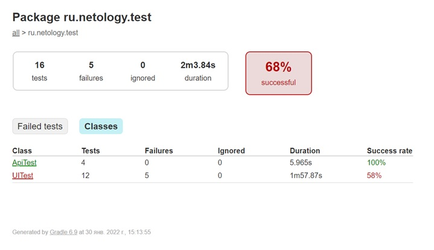
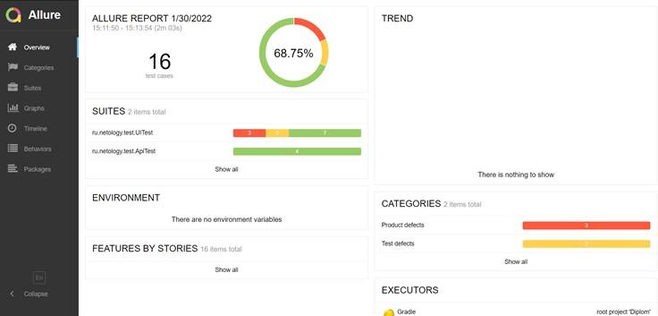

# Отчет по итогам тестирования  

В ходе автоматизации тестирования были реализованы позитивные и негативные сценарии и реализована поддержка двух баз данных - MySQL и PostgreSQL.  

### Количество тест-кейсов  
Всего 16, из них неуспешных 5, успешных 11, что составило 68,75 % успешно пройденных тестов.  

#### Отчёт по Gradle  

#### Отчёт по Allure Report  

### Общие рекомендации:  
•	добавить ограничения на количество символов, вводимых в поля, так как их отсутствие влияет на безопасность системы;  
•	добавить выделение цветом активной кнопки "Купить" или "Купить в кредит" при переключении между ними;  
•	сохранять заполненные поля формы при переключении между функциями "Купить" и "Купить в кредит";  
•	настроить вывод корректных сообщений пользователю после заполнения формы и ее отправки в банк. В случае, если поля формы не заполнены, вместо надписи "Неверный формат" должна быть предупреждающая надпись "Поле обязательно для заполнения".  